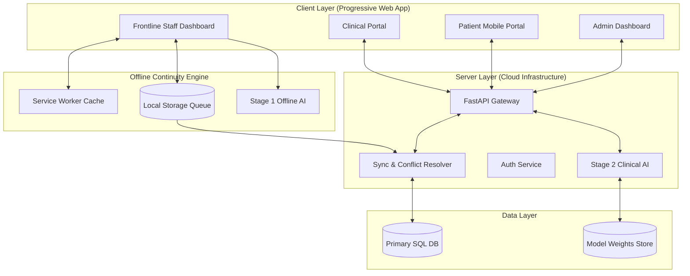
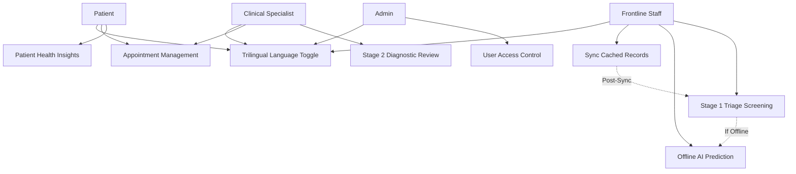
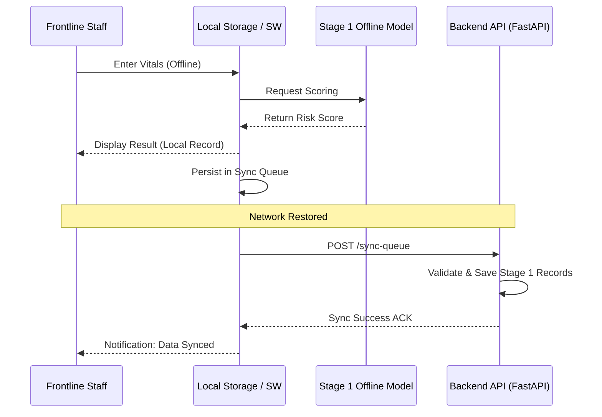

# BloomCare Software Requirements Specification (SRS) Diagrams

## System Architecture


```mermaid
graph TD
    subgraph "Client Layer (Progressive Web App)"
        FS[Frontline Staff Dashboard]
        CP[Clinical Portal]
        PP[Patient Mobile Portal]
        AD[Admin Dashboard]
    end

    subgraph "Offline Continuity Engine"
        SW[Service Worker Cache]
        LS[(Local Storage Queue)]
        OAI[Stage 1 Offline AI]
    end

    subgraph "Server Layer (Cloud Infrastructure)"
        API[FastAPI Gateway]
        S2AI[Stage 2 Clinical AI]
        AUTH[Auth Service]
        SYNC[Sync & Conflict Resolver]
    end

    subgraph "Data Layer"
        PDB[(Primary SQL DB)]
        MDB[(Model Weights Store)]
    end

    FS <--> SW
    FS <--> LS
    LS --> SYNC
    FS --> OAI
    
    API <--> SYNC
    API <--> S2AI
    SYNC <--> PDB
    S2AI <--> MDB
    
    CP <--> API
    PP <--> API
    AD <--> API
```

## Use Case Diagram


```mermaid
flowchart TD

    %% Actors
    FS[Frontline Staff]
    CS[Clinical Specialist]
    PT[Patient]
    AM[Admin]

    %% Use Cases
    UC1[Stage 1 Triage Screening]
    UC2[Offline AI Prediction]
    UC3[Sync Cached Records]
    UC4[Stage 2 Diagnostic Review]
    UC5[Patient Health Insights]
    UC6[Appointment Management]
    UC7[User Access Control]
    UC8[Trilingual Language Toggle]

    %% Relationships
    FS --> UC1
    FS --> UC2
    FS --> UC3
    FS --> UC8

    CS --> UC4
    CS --> UC6
    CS --> UC8

    PT --> UC5
    PT --> UC6
    PT --> UC8

    AM --> UC7
    AM --> UC8

    %% Dependencies
    UC1 -. "If Offline" .-> UC2
    UC3 -. "Post-Sync" .-> UC1
```
## Sequence Diagram


```mermaid
sequenceDiagram
    participant Nurse as Frontline Staff
    participant Browser as Local Storage / SW
    participant AI as Stage 1 Offline Model
    participant Cloud as Backend API (FastAPI)

    Nurse->>Browser: Enter Vitals (Offline)
    Browser->>AI: Request Scoring
    AI-->>Browser: Return Risk Score
    Browser-->>Nurse: Display Result (Local Record)
    Browser->>Browser: Persist in Sync Queue
    
    Note over Nurse, Cloud: Network Restored
    
    Browser->>Cloud: POST /sync-queue
    Cloud->>Cloud: Validate & Save Stage 1 Records
    Cloud-->>Browser: Sync Success ACK
    Browser-->>Nurse: Notification: Data Synced
```
````
